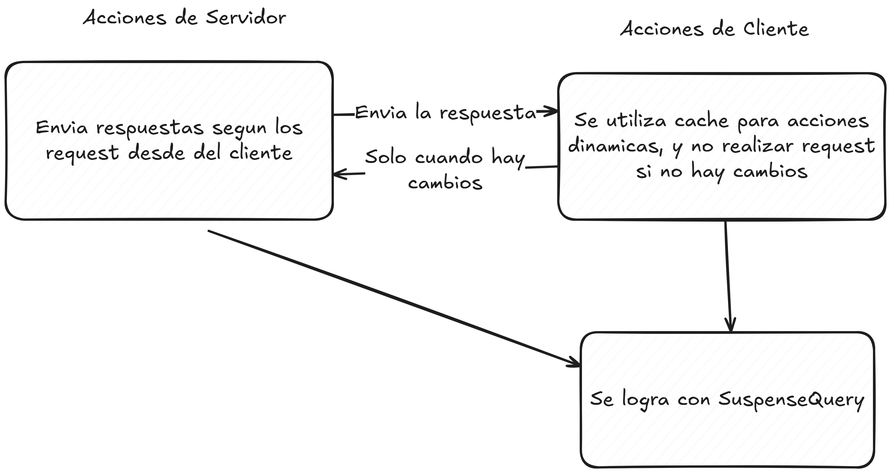
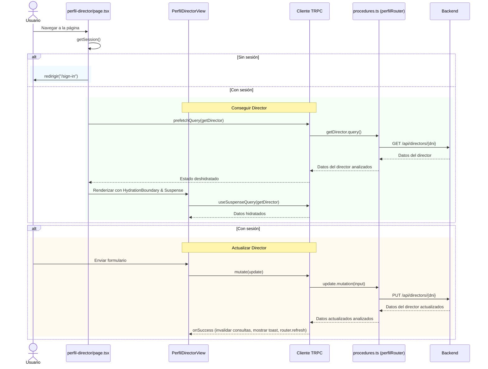
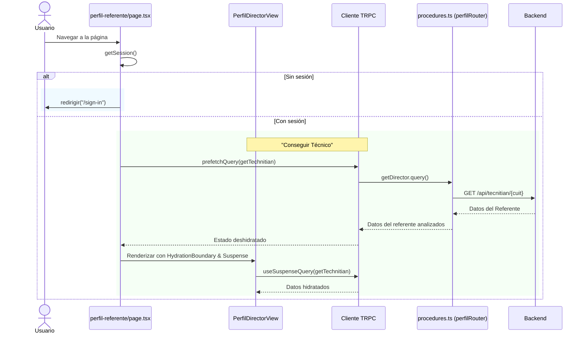
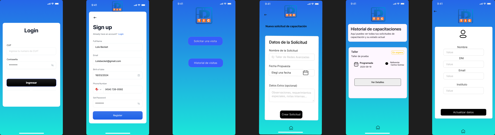

# TIC Service Request Platform - Sistema de Gestión de Solicitudes

## Table of Contents

- [Core Framework & Runtime](#core-framework--runtime)
- [Gestión de Formularios](#gestión-de-formularios)
- [Capa de API y Fetch](#capa-de-api-y-fetch)
- [Características Claves](#características-claves)
- [Manual de Usuario](#manual-de-usuario)
  - [Inicio de Sesión](#inicio-de-sesión)
  - [Página Principal (Inicio)](#página-principal-inicio)
  - [Perfil](#perfil)
  - [Nueva Visita](#nueva-visita)
  - [Historial de Visitas](#historial-de-visitas)
- [Módulos](#módulos)
  - [Autenticación](#autenticación)
  - [Inicio](#inicio)
  - [Solictar una visita](#solicitar-una-visita)
  - [Historial de Visitas](#historial-de-visitas)
  - [Perfil](#perfil-1)
- [Características Futuras](#características-futuras)
- [Evolucion de mock up de UI/UX](#evolucion-de-mock-up-de-uiux)

## Core Framework & Runtime

*Next.js 15.4.6 - Framework de React para aplicaciones web modernas*
- Utiliza App Router para renderizado del lado del servidor (SSR) y generación estática (SSG)
- Optimización automática de rendimiento y SEO
- Enrutamiento basado en archivos para una estructura intuitiva
- Soporte nativo para API routes y middleware

*React 19.1.0 - Librería principal para construir interfaces de usuario*
- Componentes reutilizables y modulares
- Virtual DOM para actualizaciones eficientes
- Hooks para gestión de estado y efectos secundarios

*TypeScript 5 - Lenguaje tipado que extiende JavaScript*
- Type safety en todo el stack
- Mejor experiencia de desarrollo con autocompletado
- Detección temprana de errores en tiempo de desarrollo
- Documentación implícita mediante tipos

*Estilos y UI*
- Shadcn: Componentes headless con estilos predefinidos sensibles
- TailwindCSS: CSS framework basado en "utility-first"
- Lucide React: Libreria de iconos utilizada para manetener una iconografia consistente

## Gestión de Formularios

*React Hook Form  - Gestión de formularios de alto rendimiento*
- Minimiza re-renders innecesarios
- Validación eficiente en tiempo real
- Manejo de estados de formulario (touched, dirty, errors)
- Integración sencilla con componentes controlados y no controlados
- Soporte para formularios complejos y anidados

*@hookform/resolvers - Integradores de validación*
- Conecta React Hook Form con múltiples librerías de validación
- Permite usar Zod como validador principal

## Capa de API y Fetch

*tRPC - End-to-end type-safe APIs*

- @trpc/client - Cliente para llamadas API type-safe
- @trpc/server - Servidor para crear endpoints tipados
- @trpc/tanstack-react-query - Integración con React Query

Beneficios:

- Sin necesidad de code generation
- Autocompletado completo en el IDE
- Errores de tipo en tiempo de desarrollo
- Refactorización segura
- Documentación implícita mediante tipos

*TanStack React Query - Gestión de estado del servidor*

- Caché inteligente de datos
- Invalidación y refetch automático
- Manejo de estados de carga y error
- Background data synchronization

Características implementadas:

- Queries para fetching de datos
- Mutations para actualizaciones
- Prefetching para mejor UX
- Stale-while-revalidate pattern

## Características Claves

*client-only & server-only - Control de ejecución del código*
- Garantiza que el código sensible solo se ejecute en el servidor
- Optimiza el bundle del cliente excluyendo código innecesario
- Previene errores de hidratación

*zod - Validacion de Tipos en la capa de salida y entrada de datos*
- Asegura los tipos y integridad de los datos que ingresan y salen de la aplicacion
- Se puede utilizar en el cliente y en el servidor


## Estructura del Proyecto
La Plataforma de Solicitudes de Servicio TIC sigue una arquitectura modular diseñada para escalabilidad, mantenibilidad y separación de responsabilidades. El App Router de Next.js se

- src/modules/: El corazón de la lógica de la aplicación. Cada módulo representa un dominio de funcionalidad (ej. auth, perfil, historial-capacitaciones) y contiene:
    - server/: Procedimientos tRPC para operaciones del lado del servidor, obtención de datos y mutaciones. Esto asegura llamadas API type-safe y encapsula la lógica del backend.
    - ui/: Componentes Shadcn/ui para elementos del sistema de diseño consistentes y accesibles.
    - Componentes personalizados (ej. error-state.tsx, loading-state.tsx) para patrones UI específicos de la aplicación.
- src/trpc/: Configuración centralizada de tRPC, incluyendo configuración del cliente, cliente de consultas y composición de routers. Se integra con TanStack React Query para una
     gestión eficiente de datos.                                                              ).

1. Enrutamiento: El usuario navega a una página en src/app/, activando el prefetching de tRPC para datos iniciales.
2. Lógica de Módulo: La página delega al módulo correspondiente los procedimientos del servidor para operaciones de datos.                 .

En la siguiente figura se muestra como se utiliza trpc para cachear las respuestas de la API:
 

Como ejemplo de como funcionan los request se muestra parte del código correspondiente al módulo de perfil:
```typescript
getDirector: protectedProcedure
    .input(z.void())
    .query(async ({ ctx }) => {
      const dni = ctx.auth.userId

      const response = await fetch(`${BACKEND_URL}/api/directors/${dni}`, {
        method: "GET",
        headers: { "Content-Type": "application/json" },
        cache: "no-store",
      })

      if (!response.ok) {
        throw new TRPCError({ code: "NOT_FOUND", message: "Director no encontrado" })
      }

      const director = directors.parse(await response.json())

      if (director.dni !== dni) {
        throw new TRPCError({ code: "NOT_FOUND", message: "Director no encontrado" })
      }

      return director
    }),
```
Se observa como la validación de datos ocurren el lado del servidor de la aplicación, así como también la validación de la estrucura de los datos usando zod, esto permite que en el lado del cliente no sea necesario validar la respuesta. También se destaca, que si el middleware falla, lo que corresponde a la capa de datos esta totalmente separado por el protectedProcedure, que no permite a usuarios no registrados acceder a los datos por más que puedan ingresar a la página por el fallo del middleware.

## Manual de Usuario

### Inicio de Sesión
1. Navega a la página de inicio de sesión (`/sign-in`).
2. Ingresa tu DNI y contraseña.
3. Haz clic en "Iniciar Sesión" para acceder a la aplicación.
4. Si no tienes sesión, serás redirigido automáticamente a esta página.

### Página Principal (Inicio)
- Después de iniciar sesión, llegarás a la página principal.
- Desde aquí, puedes acceder a las secciones: Perfil, Nueva Capacitación, Historial de Capacitaciones.
- Usa la navegación para moverte entre las diferentes áreas de la aplicación.

### Perfil
- En la sección de perfil, puedes ver tus datos personales.
- Para directores: Puedes editar nombre, apellido, teléfono y email. El DNI y el dominio del instituto son de solo lectura.
- Para referentes técnicos: Los datos son de solo lectura (funcionalidad en desarrollo).
- Al actualizar, se enviará la información al backend y se mostrará una notificación de éxito.

### Nueva Visita
- Accede a la página de nueva visita para crear una nueva sesión.
- Llena el formulario con los detalles requeridos.
- Envía el formulario para registrar la visita.

### Historial de Visitas
- Ve el historial de visitas realizadas.
- Aquí puedes revisar sesiones pasadas y sus detalles.

## Módulos

### Autenticación
Maneja la autenticación de usuarios, incluyendo la funcionalidad de inicio de sesión y gestión de sesiones.

### Inicio
Sirve como el panel principal o página de inicio, proporcionando navegación y acceso a varias funciones como perfil, capacitaciones y creación de nuevas capacitaciones.

### Solicitar una visita
Permite a los usuarios crear nuevas sesiones de capacitación, incluyendo envío de formularios e integración con el backend.

###  Historial de Solicitudes
Gestiona el historial de sesiones de solcitudes, permitiendo a los usuarios ver capacitaciones pasadas.

### Perfil
Ofrece vistas diferenciadas para perfiles del director y el técnico, al primero se le facilita la edición de datos como nombre, apellido, DNI, teléfono, email. Los datos del técnico no se permiten realizar modificaciones porque no son los datos del director. Utiliza formularios reactivos con validación robusta mediante Zod, integración con tRPC para operaciones del servidor, y estados de carga y error para una experiencia de usuario fluida. Este módulo asegura la consistencia de datos y proporciona retroalimentación inmediata a través de notificaciones toast.

En los siguientes diagramas de secuencia se muestra el flujo infomación desde el front end hasta la API, todos los módulos realizan acciones similares.

**Perfil de Director**


**Perfil de Referente**


## Características Futuras

Esta sección describe las funcionalidades planificadas para futuras versiones de la plataforma TIC Service Request. Estas características están en proceso de diseño o desarrollo y no están disponibles en la versión actual.

### Sistema de Notificaciones
- Notificaciones push para actualizaciones de solicitudes
- Alertas por notificiones para visitas que ya terminaron

### Integración con Calendario
- Sincronización con Google Calendar
- Vista de calendario para programar visitas
- Recordatorios automáticos de eventos

### Modo Oscuro
- Tema oscuro para reducir fatiga visual

### Roles y Permisos Avanzados
- Auditoría de acciones de usuarios

### Dashboard de Análisis
- Métricas de uso de la plataforma
- Gráficos de solicitudes por período
- Esto se puede lograr con soluciones como [Sentry](https://sentry.io/) 

### Documentación de API
- Documentación automática con Swagger/OpenAPI
- Ejemplos de uso para desarrolladores
- Sandbox para pruebas

### Expansión de Pruebas
- Cobertura completa de tests unitarios e integración
- Tests end-to-end con Playwright 


## Evolucion de mock up de UI/UX

Aca se muestra la evolución del diseño de las páginas para la aplicación, se comenzo a trabajar un diseño borrador en excalidraw, y luego se utilizó Figma. Para la segunda versión se tomo más en cuenta los colores encontrador en la página web de la [Dirección de TIC](tic.edu.misiones.gob.a) 





