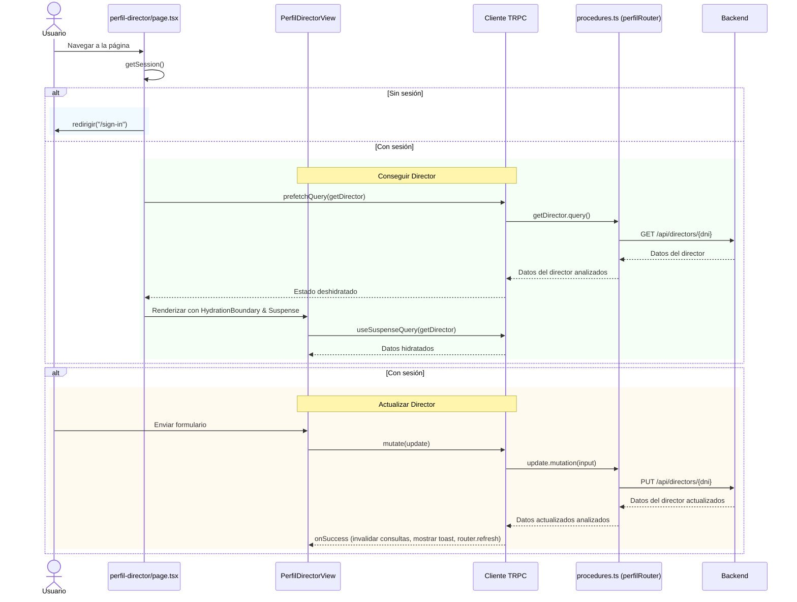
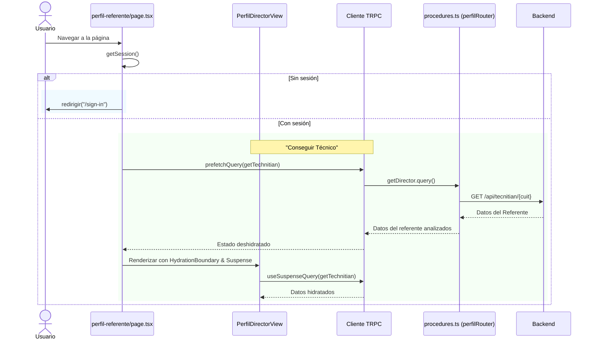

# TIC Service Request Platform - Sistema de Gestión de Solicitudes

## Core Framework & Runtime

*Next.js 15.4.6 - Framework de React para aplicaciones web modernas*
- Utiliza App Router para renderizado del lado del servidor (SSR) y generación estática (SSG)
- Optimización automática de rendimiento y SEO
- Enrutamiento basado en archivos para una estructura intuitiva
- Soporte nativo para API routes y middleware

*React 19.1.0 - Librería principal para construir interfaces de usuario*
- Componentes reutilizables y modulares
- Virtual DOM para actualizaciones eficientes
- Hooks para gestión de estado y efectos secundarios

*TypeScript 5 - Lenguaje tipado que extiende JavaScript*
- Type safety en todo el stack
- Mejor experiencia de desarrollo con autocompletado
- Detección temprana de errores en tiempo de desarrollo
- Documentación implícita mediante tipos

*Estilos y UI*
- Shadcn: Componentes headless con estilos predefinidos sensibles
- TailwindCSS: CSS framework basado en "utility-first"
- Lucide React: Libreria de iconos utilizada para manetener una iconografia consistente

## Gestión de Formularios

*React Hook Form  - Gestión de formularios de alto rendimiento*
- Minimiza re-renders innecesarios
- Validación eficiente en tiempo real
- Manejo de estados de formulario (touched, dirty, errors)
- Integración sencilla con componentes controlados y no controlados
- Soporte para formularios complejos y anidados

*@hookform/resolvers - Integradores de validación*
- Conecta React Hook Form con múltiples librerías de validación
- Permite usar Zod como validador principal

## Capa de API y Fetch

*tRPC - End-to-end type-safe APIs*

- @trpc/client - Cliente para llamadas API type-safe
- @trpc/server - Servidor para crear endpoints tipados
- @trpc/tanstack-react-query - Integración con React Query

Beneficios:

- Sin necesidad de code generation
- Autocompletado completo en el IDE
- Errores de tipo en tiempo de desarrollo
- Refactorización segura
- Documentación implícita mediante tipos

*TanStack React Query - Gestión de estado del servidor*

- Caché inteligente de datos
- Invalidación y refetch automático
- Manejo de estados de carga y error
- Background data synchronization

Características implementadas:

- Queries para fetching de datos
- Mutations para actualizaciones
- Prefetching para mejor UX
- Stale-while-revalidate pattern

## Características Claves

*client-only & server-only - Control de ejecución del código*
- Garantiza que el código sensible solo se ejecute en el servidor
- Optimiza el bundle del cliente excluyendo código innecesario
- Previene errores de hidratación

*zod - Validacion de Tipos en la capa de salida y entrada de datos*
- Asegura los tipos y integridad de los datos que ingresan y salen de la aplicacion
- Se puede utilizar en el cliente y en el servidor

## Manual de Usuario

### Inicio de Sesión
1. Navega a la página de inicio de sesión (`/sign-in`).
2. Ingresa tu DNI y contraseña.
3. Haz clic en "Iniciar Sesión" para acceder a la aplicación.
4. Si no tienes sesión, serás redirigido automáticamente a esta página.

### Página Principal (Inicio)
- Después de iniciar sesión, llegarás a la página principal.
- Desde aquí, puedes acceder a las secciones: Perfil, Nueva Capacitación, Historial de Capacitaciones.
- Usa la navegación para moverte entre las diferentes áreas de la aplicación.

### Perfil
- En la sección de perfil, puedes ver tus datos personales.
- Para directores: Puedes editar nombre, apellido, teléfono y email. El DNI y el dominio del instituto son de solo lectura.
- Para referentes técnicos: Los datos son de solo lectura (funcionalidad en desarrollo).
- Al actualizar, se enviará la información al backend y se mostrará una notificación de éxito.

### Nueva Capacitación
- Accede a la página de nueva capacitación para crear una nueva sesión.
- Llena el formulario con los detalles requeridos.
- Envía el formulario para registrar la capacitación.

### Historial de Capacitaciones
- Ve el historial de capacitaciones realizadas.
- Aquí puedes revisar sesiones pasadas y sus detalles.

## Módulos

### Autenticación
Maneja la autenticación de usuarios, incluyendo la funcionalidad de inicio de sesión y gestión de sesiones.

### Inicio
Sirve como el panel principal o página de inicio, proporcionando navegación y acceso a varias funciones como perfil, capacitaciones y creación de nuevas capacitaciones.

### Solictar una visita
Permite a los usuarios crear nuevas sesiones de capacitación, incluyendo envío de formularios e integración con el backend.

###  Historial de Visitas
Gestiona el historial de sesiones de capacitación, permitiendo a los usuarios ver capacitaciones pasadas.

### Perfil
Ofrece vistas diferenciadas para perfiles del director y el técnico, al primero se le facilita la edición de datos como nombre, apellido, DNI, teléfono, email. Los datos del técnico no se permiten realizar modificaciones porque no son los datos del director. Utiliza formularios reactivos con validación robusta mediante Zod, integración con tRPC para operaciones del servidor, y estados de carga y error para una experiencia de usuario fluida. Este módulo asegura la consistencia de datos y proporciona retroalimentación inmediata a través de notificaciones toast.

**Perfil de Director**

**Perfil de Referente**

