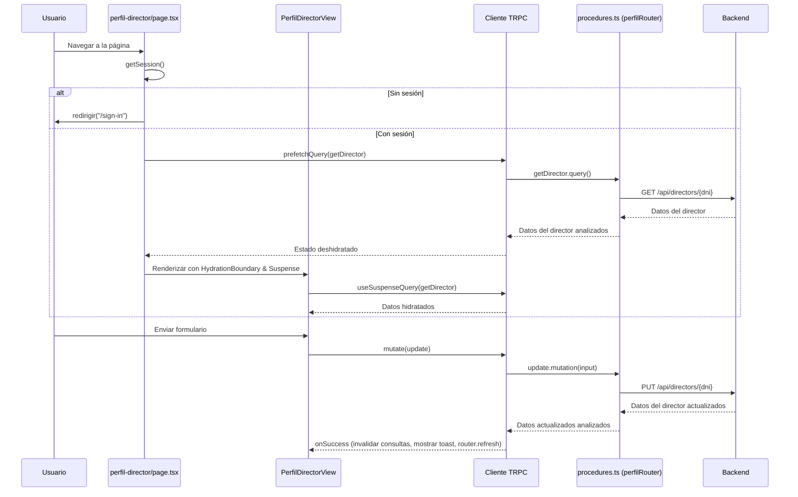
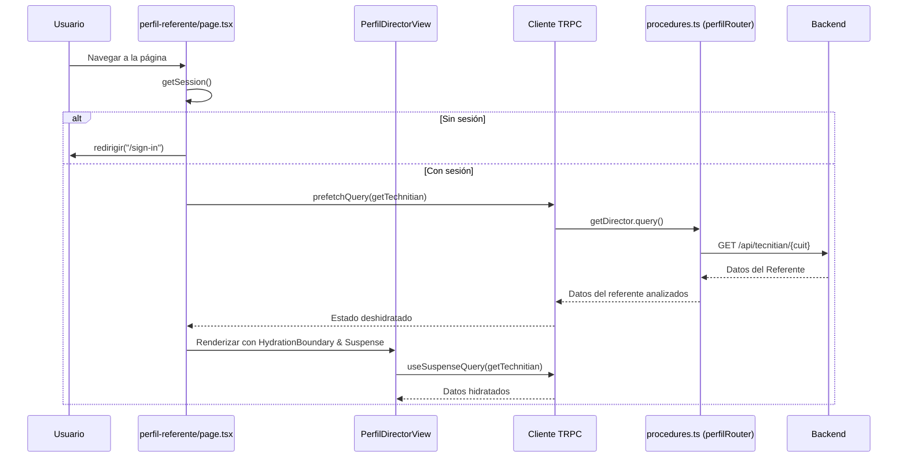

# README del Proyecto

## Manual de Usuario

### Inicio de Sesión
1. Navega a la página de inicio de sesión (`/sign-in`).
2. Ingresa tu DNI y contraseña.
3. Haz clic en "Iniciar Sesión" para acceder a la aplicación.
4. Si no tienes sesión, serás redirigido automáticamente a esta página.

### Página Principal (Inicio)
- Después de iniciar sesión, llegarás a la página principal.
- Desde aquí, puedes acceder a las secciones: Perfil, Nueva Capacitación, Historial de Capacitaciones.
- Usa la navegación para moverte entre las diferentes áreas de la aplicación.

### Perfil
- En la sección de perfil, puedes ver tus datos personales.
- Para directores: Puedes editar nombre, apellido, teléfono y email. El DNI y el dominio del instituto son de solo lectura.
- Para referentes técnicos: Los datos son de solo lectura (funcionalidad en desarrollo).
- Al actualizar, se enviará la información al backend y se mostrará una notificación de éxito.

### Nueva Capacitación
- Accede a la página de nueva capacitación para crear una nueva sesión.
- Llena el formulario con los detalles requeridos.
- Envía el formulario para registrar la capacitación.

### Historial de Capacitaciones
- Ve el historial de capacitaciones realizadas.
- Aquí puedes revisar sesiones pasadas y sus detalles.

## Módulos

### Autenticación
Maneja la autenticación de usuarios, incluyendo la funcionalidad de inicio de sesión y gestión de sesiones.

### Inicio
Sirve como el panel principal o página de inicio, proporcionando navegación y acceso a varias funciones como perfil, capacitaciones y creación de nuevas capacitaciones.

### Solictar una visita
Permite a los usuarios crear nuevas sesiones de capacitación, incluyendo envío de formularios e integración con el backend.

###  Historial de Visitas
Gestiona el historial de sesiones de capacitación, permitiendo a los usuarios ver capacitaciones pasadas.

### Perfil

**Perfil de Director**

**Perfil de Referente**

